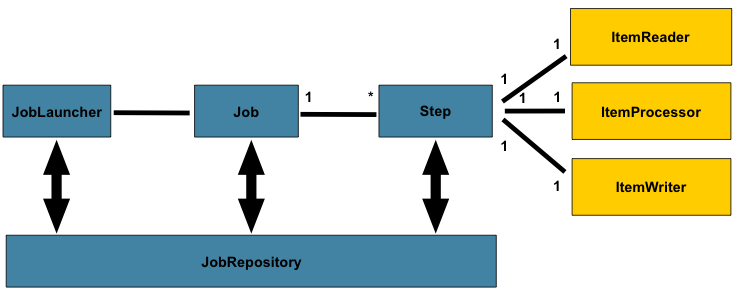

# Spring Batch Quartz

This Application demonstrates functioning of spring batch with manual trigger as well as quartz scheduler triggered batch job.

This repo has 2 spring batch jobs.
* `Manual Batch Job` - This batch job is triggered by [BatchJobController](src/main/java/com/midnight/springbatchquartz/controller/BatchJobController.java). 
   It reads data from `source_product` table in DB, processes it in chunks using batch and pushes to another table `target_product` in DB.
* `Scheduled Batch Job` - It does same operation as above but is scheduled instead using quartz scheduler.

See Configurations: [BatchConfiguration](src/main/java/com/midnight/springbatchquartz/config/BatchConfiguration.java),
[QuartzConfiguration](src/main/java/com/midnight/springbatchquartz/config/QuartzConfiguration.java)

## Contents
* [Run Application](#Run-this-application)
* [Spring Batch](#Spring-Batch)
  * [Step](#Spring-batch-Step)
  * [Listeners](#Job-Listeners)
  * [Job](#Batch-Job)
* [Spring Quartz](#Spring-Quartz)


## Run this application

>  * Run ` docker-compose up -d` to start postgress container.
>  * Start `SpringBatchQuartzApplication` or run `./gradlew bootRun`

### Spring Batch
***
Spring batch is a very efficient tool for batch processing. [See Documentation.](https://docs.spring.io/spring-batch/docs/current/reference/html/index.html)

Below is a reference to Spring Batch model.
> 
 
A Job is core of spring batch. A batch job can have one or more steps.

### Spring batch Step

Spring batch supports 2 types of processing, one is `chunk` based processing and another
is `tasklet` based processing.

* >`chunk` based approach helps to divide step execution into chunks, it is preferable when
dealing with large amount of data. It requires `reader` (reads from source), `process` (processes read data in chunks) and `writer` (writes to destination in chunks).

    There are multiple `reader` and `writer` implementations provided by spring batch out of the box.

    ```java
    @Bean(name = "manualBatchJobStep")
    public Step manualBatchJobStep(ProductsReader reader, ProductProcessor processor, ProductWriter writer) {
        return stepBuilderFactory.get("manualStep")
                .<SourceProduct, TargetProduct>chunk(2)
                .reader(reader)
                .processor(processor)
                .writer(writer)
                .faultTolerant()
                .skipLimit(2)
                .skip(Exception.class)
                .build();
    }
    ```
    See implementaions: [ProductsReader](src/main/java/com/midnight/springbatchquartz/reader/ProductsReader.java), 
    [ProductProcessor](src/main/java/com/midnight/springbatchquartz/processor/ProductProcessor.java),
    [ProductWriter](src/main/java/com/midnight/springbatchquartz/writer/ProductWriter.java)

    [BatchConfiguration](src/main/java/com/midnight/springbatchquartz/config/BatchConfiguration.java)

* > `tasklet` based processing is when you need only processing logic for your job. Tasklets are useful for tasks like cleanup.

    ```java
        @Bean(name = "taskletBatchJobStep")
        public Step taskletBatchJobStep(Tasklet tasklet) {
            return stepBuilderFactory.get("manualStep")
                    .tasklet(tasklet)
                    .build();
        }
    ```

### Job Listeners

`Listeners provide ability to execute code before and after a job is executed.`

See implementations: [Listener](src/main/java/com/midnight/springbatchquartz/listener/ManualJobListener.java)

### Batch Job

A batch job can contain one or more steps. Below is how you can configure a job.

```java
    @Bean(name = "manualBatchJob")
    public Job manualBatchJob(@Qualifier("manualBatchJobStep") Step manualStep, ManualJobListener listener) {

        return jobBuilderFactory.get("manualJob")
                .listener(listener)
                .incrementer(new RunIdIncrementer())
                .flow(manualStep)
                .end()
                .build();
    }
```

See Config: [BatchConfiguration](src/main/java/com/midnight/springbatchquartz/config/BatchConfiguration.java)

`Triggering a job manually` See  [BatchJobService](src/main/java/com/midnight/springbatchquartz/service/BatchJobService.java)

```java
    @Autowired
    private final JobLauncher jobLauncher;

    public String triggerBatchJob(Job job) {

        JobParameters jobParameters = new JobParametersBuilder()
                .addLong("startTime", currentTimeMillis())
                .toJobParameters();

        try {
            return jobLauncher.run(job, jobParameters).getStatus().name();
        } catch (JobExecutionException e) {
            e.printStackTrace();
        }

        return BatchStatus.FAILED.name();
    }
```


## Spring Quartz
***

Spring quartz is built on top of native quartz api. 

`Quartz is a framework which is very efficient for scheduling tasks and is very flexible.` 

### Quartz Job
  A job is core object which will contain the actual logic for your job. In this application
  it triggers a batch job. For it we need to implement `QuartzJobBean`.

  See Quartz Job [ScheduledJob](src/main/java/com/midnight/springbatchquartz/scheduler/ScheduledJob.java).


### Quartz Configuration
  
  Quartz Configuration requires 
  * `JobDetail` - contains your quartz job bean, in this case `ScheduledJob`.
  * `CronTrigger` - contains `JobDetail` and info about cron expression, missfire config etc.
  * `SchedulerFactoryBean` - parent bean that contains info about triggers, data sources, custom properties file etc.

  See [QuartzConfiguration](src/main/java/com/midnight/springbatchquartz/config/QuartzConfiguration.java).
  
> Since quartz job bean ( ScheduledJob ) is initialized at runtime for every trigger, spring cannot inject
> required dependencies in ScheduledJob bean by default. We need to add this autowiring capability for our 
> ScheduledJob bean.

See implementation [SchedulerJobFactory](src/main/java/com/midnight/springbatchquartz/scheduler/SchedulerJobFactory.java).


